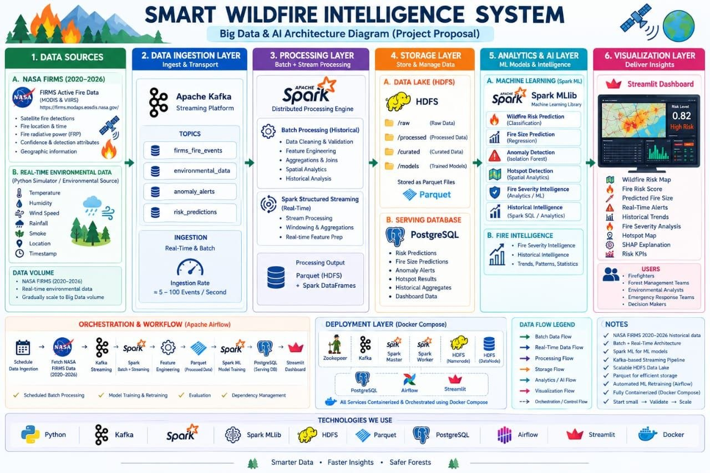

# 🔥 Smart Wildfire Intelligence System

> **A Big Data and Machine Learning platform for real-time wildfire monitoring, analytics, prediction, anomaly detection, and alert generation.**



## 📌 Project Overview

The **Smart Wildfire Intelligence System** is an end-to-end Big Data solution designed to process large-scale wildfire observations, enrich them with environmental telemetry, run machine learning models, detect anomalies, generate alerts, and present the results through an interactive dashboard.

The system is built around a distributed data pipeline using **Apache Hadoop HDFS, Apache Spark, Apache Kafka, PostgreSQL, Apache Airflow, Python, and Streamlit**.

The project processes NASA FIRMS wildfire observations covering **2020–2026** and is designed to support both **historical batch processing** and **real-time streaming**.

---

## 🎯 Objectives

The main objectives of the project are to:

- Process large-scale wildfire satellite observations efficiently.
- Store raw and processed data in distributed storage.
- Clean, validate, deduplicate, and standardize wildfire data.
- Engineer useful features for machine learning.
- Classify wildfire events into **Low, Medium, and High risk levels**.
- Predict **Fire Radiative Power (FRP)** as a proxy for fire size/intensity.
- Detect anomalous wildfire events in real time.
- Generate alerts from risk predictions and anomaly detection.
- Store analytical results in PostgreSQL.
- Orchestrate finite data workflows with Airflow.
- Provide an interactive monitoring dashboard.
- Support a reproducible Docker-based development environment.

---

## 🏗️ System Architecture

```text
                         ┌─────────────────────────┐
                         │   NASA FIRMS Dataset    │
                         │       2020 – 2026       │
                         └────────────┬────────────┘
                                      │
                                      ▼
                         ┌─────────────────────────┐
                         │   Spark Batch Pipeline  │
                         │                         │
                         │ Schema Harmonization    │
                         │ Data Cleaning            │
                         │ Validation               │
                         │ Deduplication            │
                         │ Feature Engineering      │
                         └────────────┬────────────┘
                                      │
                         ┌────────────┴────────────┐
                         ▼                         ▼
                 ┌───────────────┐        ┌────────────────┐
                 │ HDFS Curated  │        │ HDFS Features  │
                 │    Data       │        │  ML-ready Data │
                 └───────────────┘        └───────┬────────┘
                                                   │
                                                   ▼
                                      ┌────────────────────────┐
                                      │ Machine Learning Models │
                                      │                        │
                                      │ Risk Classification    │
                                      │ Fire Size Regression   │
                                      │ Anomaly Detection      │
                                      └────────────┬───────────┘
                                                   │
              ┌────────────────────────────────────┼─────────────────────┐
              │                                    │                     │
              ▼                                    ▼                     ▼
      ┌───────────────┐                  ┌────────────────┐      ┌──────────────┐
      │ Risk          │                  │ Anomaly        │      │ Fire Size    │
      │ Predictions   │                  │ Detection      │      │ Predictions  │
      └───────┬───────┘                  └───────┬────────┘      └──────┬───────┘
              │                                  │                      │
              └──────────────────┬───────────────┴──────────────────────┘
                                 ▼
                         ┌─────────────────┐
                         │ Alert Generation│
                         └────────┬────────┘
                                  │
                                  ▼
                         ┌─────────────────┐
                         │   PostgreSQL    │
                         │                 │
                         │ Fire Events     │
                         │ Predictions     │
                         │ Anomalies       │
                         │ Alerts          │
                         └────────┬────────┘
                                  │
                                  ▼
                         ┌─────────────────┐
                         │   Streamlit     │
                         │    Dashboard    │
                         └─────────────────┘


REAL-TIME STREAMING

 Fire Simulator ─────► Kafka ─────► Spark Structured Streaming
                                      │
 Environmental Simulator ─► Kafka ───┘
                                      │
                                      ▼
                             HDFS / PostgreSQL
                                      │
                                      ▼
                              Risk / Anomaly / Alerts
```

---

## 🧰 Technology Stack

| Technology | Purpose |
|---|---|
| **Python** | Data processing, simulators, ML, dashboard logic |
| **Apache Spark 3.3** | Distributed batch processing and streaming |
| **Apache Hadoop HDFS** | Distributed storage |
| **Apache Kafka 3.9** | Real-time event streaming |
| **PostgreSQL** | Analytical/application database |
| **Apache Airflow 2.9** | Workflow orchestration |
| **Streamlit** | Interactive dashboard |
| **Plotly** | Data visualization |
| **Docker & Docker Compose** | Reproducible multi-service environment |
| **Jupyter** | Optional interactive analysis |

---

## 📂 Project Structure

```text
.
├── airflow/
│   ├── dags/                    # Airflow workflows
│   └── docker/                  # Airflow Docker image
│
├── configs/
│   └── config.yaml              # Main project configuration
│
├── dashboard/
│   ├── app.py                   # Streamlit dashboard
│   ├── db.py                    # Database connection
│   ├── queries.py               # Dashboard queries
│   └── requirements.txt
│
├── docs/
│   ├── lab1.md                  # Data engineering documentation
│   ├── lab2_feature_list.md     # ML feature documentation
│   └── lab4_postgres_airflow.md # PostgreSQL & Airflow documentation
│
├── images/
│   ├── Dashboard Overview.jpg
│   ├── Interactive Fire Map.jpg
│   ├── Recent Fire Events.jpg
│   └── NTI_Proposal.jpg
│
├── postgres/
│   ├── init-wildfire-db.sql     # Database initialization
│   └── schema_wildfire.sql      # Wildfire database schema
│
├── reports/
│   ├── data_profile/            # Dataset profiling reports
│   ├── data_quality/            # Data quality reports
│   └── ml/                      # Machine learning evaluation reports
│
├── scripts/
│   ├── start.sh / start.ps1
│   ├── stop.sh / stop.ps1
│   ├── status.sh / status.ps1
│   └── ...                      # Setup and test scripts
│
├── schemas/
│   └── data_contract.md          # Canonical data contract
│
├── spark/
│   └── apps/                    # Spark example/test applications
│
├── src/
│   ├── ml/                      # Machine learning pipelines
│   ├── profiling/               # Dataset profiling
│   ├── schemas/                 # Data schemas
│   ├── simulator/               # Fire/environment simulators
│   ├── spark/                   # Spark batch & streaming jobs
│   └── utils/                   # Shared utilities
│
├── tests/
│   ├── test_unit.py
│   └── test_integration.py
│
├── docker-compose.yml            # Main infrastructure definition
├── .env.example                  # Environment template
├── requirements.txt              # Python dependencies
└── README.md
```

---

## 🔄 Main Data Pipeline

### 1. Data Ingestion

The system starts with wildfire observations from **NASA FIRMS**.

The historical dataset contains observations from **2020 through 2026**.

The project also includes simulators for real-time processing:

- `fire_simulator.py` replays wildfire observations as events.
- `environmental_simulator.py` generates environmental telemetry.

---

### 2. Data Profiling

Before processing the data, the pipeline profiles the dataset to understand:

- Number of records
- Columns and data types
- Missing values
- Numeric distributions
- Data quality
- Schema differences between data sources

The profiling outputs are stored under:

```text
reports/data_profile/
reports/data_quality/
```

---

### 3. Schema Harmonization

The project handles schema differences between historical archive data and NASA's Near Real-Time (NRT) data.

A canonical schema is defined so that downstream Spark jobs receive a consistent structure.

The formal contract is documented in:

```text
schemas/data_contract.md
```

---

### 4. Data Cleaning & Validation

The Spark pipeline performs operations such as:

- Type normalization
- Missing-value handling
- Coordinate validation
- Temporal validation
- Deduplication
- Data consistency checks

The cleaned data is written as partitioned **Snappy-compressed Parquet**.

---

### 5. Feature Engineering

Additional features are generated from wildfire observations to prepare the data for machine learning.

The ML-ready datasets are stored in HDFS under:

```text
/wildfire/features
```

---

## 🤖 Machine Learning

The project contains multiple machine learning components.

### Risk Classification

Wildfire events are classified into three risk levels:

```text
Low
Medium
High
```

The project compares:

- Random Forest
- Gradient-Boosted Trees (GBT) One-vs-Rest

The current evaluation report identifies **GBT One-vs-Rest** as the best classifier based on test F1.

| Model | Test Accuracy | Test F1 |
|---|---:|---:|
| Random Forest | 0.6874 | 0.6952 |
| GBT One-vs-Rest | **0.6966** | **0.7006** |

Detailed results are available in:

```text
reports/ml/risk_classifier_report.json
```

---

### Fire Size / Intensity Regression

The regression model predicts **FRP (Fire Radiative Power)**, which is used as a proxy for fire size/intensity.

Models evaluated:

- Random Forest Regressor
- Gradient-Boosted Tree Regressor

| Model | Test RMSE | Test MAE | Test R² |
|---|---:|---:|---:|
| Random Forest | 14.6747 | 5.6116 | 0.2569 |
| GBT | **14.6024** | **5.1503** | **0.2642** |

The GBT model is selected as the best model based on test RMSE.

Detailed results:

```text
reports/ml/fire_size_regressor_report.json
```

---

## 🚨 Real-Time Anomaly Detection & Alerts

The streaming layer uses **Kafka + Spark Structured Streaming**.

The real-time pipeline consumes wildfire and environmental events and performs:

1. Event ingestion from Kafka
2. Schema validation and parsing
3. Feature/metric calculations
4. Anomaly detection
5. Risk inference
6. Alert generation
7. Persistence of results

Kafka topics include:

```text
firms_fire_events
environmental_data
anomaly_alerts
risk_predictions
```

The streaming applications are located under:

```text
src/spark/
```

Important streaming jobs include:

```text
anomaly_streaming.py
real_time_risk_inference.py
alert_generation.py
streaming_pipeline.py
```

---

## 🗄️ PostgreSQL Database

PostgreSQL stores the operational and analytical results generated by the pipeline.

The main wildfire tables are:

```text
fire_events
risk_predictions
fire_size_predictions
anomalies
alerts
```

Dashboard-oriented SQL views are also provided for aggregated analytics.

The database schema is defined in:

```text
postgres/schema_wildfire.sql
```

---

## ⏱️ Workflow Orchestration with Airflow

Apache Airflow is used for finite scheduled workflows such as:

- Loading curated data into PostgreSQL
- Retraining machine learning models

The long-running Spark Structured Streaming jobs are intentionally kept outside Airflow because they are continuous processes rather than finite scheduled tasks.

Airflow DAGs are located in:

```text
airflow/dags/
```

---

## 📊 Dashboard

The project includes an interactive **Streamlit** dashboard connected to PostgreSQL.

The dashboard provides:

- 🔥 Fire KPIs
- 📊 Fire activity analytics
- 🗺️ Interactive wildfire map
- 📋 Recent fire events
- Date-based filtering

### Dashboard Overview


### Interactive Fire Map


### Recent Fire Events


---

## 🐳 Running the Project with Docker

### Prerequisites

Install:

- Docker Desktop
- Git
- Git Bash or PowerShell

The project is designed to run using Docker Compose, so the main infrastructure does not require installing Hadoop, Spark, Kafka, PostgreSQL, or Airflow directly on the host machine.

---

### 1. Clone the Repository

```bash
git clone <YOUR_GITHUB_REPOSITORY_URL>
cd <YOUR_REPOSITORY_FOLDER>
```

---

### 2. Create the Environment File

Copy the provided template:

#### PowerShell

```powershell
Copy-Item .env.example .env
```

#### Git Bash

```bash
cp .env.example .env
```

Then adjust the values in `.env` if necessary.

> **Important:** Never commit `.env` to GitHub because it may contain passwords or environment-specific secrets. The repository already ignores `.env`.

---

### 3. Add the NASA FIRMS Dataset

The full historical NASA FIRMS dataset is intentionally not included in the repository because of its large size.

Place the dataset in:

```text
nasa-wildfire-data/
```

The Docker Compose configuration mounts this directory into the Spark containers as:

```text
/data/nasa-wildfire-data
```

---

### 4. Start the Infrastructure

```bash
docker compose up -d
```

Check running services:

```bash
docker compose ps
```

You should see the main services including:

- NameNode
- DataNode
- Spark Master
- Spark Worker
- Kafka
- Kafka UI
- PostgreSQL

Airflow and Jupyter are available through their Docker Compose profiles.

---

### 5. Start Airflow

```bash
docker compose --profile orchestration up -d
```

Then access the Airflow web interface using the configured Airflow port.

---

### 6. Start Optional Jupyter

```bash
docker compose --profile tools up -d
```

---

## 🧪 Testing

The repository contains both unit and integration tests:

```text
tests/test_unit.py
tests/test_integration.py
```

Infrastructure and Spark-related tests are also available under:

```text
scripts/
spark/apps/
```

---

## 📚 Documentation

Additional project documentation:

- `docs/lab1.md` — data engineering, ingestion, profiling, cleaning, HDFS, Kafka, and streaming foundation.
- `docs/lab2_feature_list.md` — machine learning feature documentation.
- `docs/lab4_postgres_airflow.md` — PostgreSQL integration and Airflow orchestration.
- `schemas/data_contract.md` — canonical data contract and schema rules.

---

## 🔐 Security & Repository Notes

Do **not** upload:

```text
.env
.env.bak
```

The repository's `.gitignore` is configured to exclude environment secrets, logs, Python cache files, IDE files, and temporary artifacts.

Before pushing, check:

```bash
git status
```

Make sure no passwords, API keys, private credentials, or other secrets are staged.

---

## 👥 Project

**Smart Wildfire Intelligence System**

An end-to-end Big Data & Machine Learning project combining:

**Data Engineering → Distributed Storage → Streaming → Machine Learning → PostgreSQL → Orchestration → Dashboard**

Built as a practical wildfire intelligence platform for monitoring and decision support.

---

## ⭐ Project Highlights

- ✅ Large-scale wildfire data processing
- ✅ NASA FIRMS data integration
- ✅ Schema drift handling
- ✅ Spark distributed processing
- ✅ HDFS data lake
- ✅ Kafka real-time streaming
- ✅ Environmental telemetry simulation
- ✅ ML risk classification
- ✅ Fire intensity regression
- ✅ Real-time anomaly detection
- ✅ Automated alert generation
- ✅ PostgreSQL analytical storage
- ✅ Airflow orchestration
- ✅ Interactive Streamlit dashboard
- ✅ Dockerized infrastructure
- ✅ Unit and integration testing
